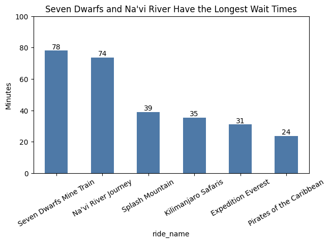
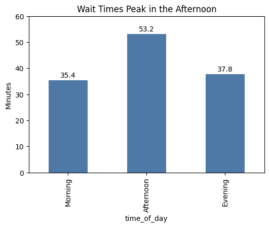
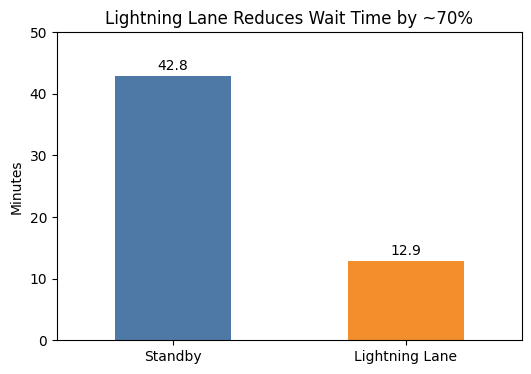

# Disney Wait Time Analysis: Is Lightning Lane Worth It?

## Project Summary

This project analyzes Disney World wait time data to evaluate whether Lightning Lane is worth the additional cost.

Key finding: Lightning Lane reduces wait times by ~70%, saving guests an average of 30 minutes per ride.

## Overview

This project analyzes Disney World ride wait times to determine whether Lightning Lane provides meaningful value to guests.

The goal is to identify patterns in wait times and evaluate when and where Lightning Lane is most beneficial.

## Business Problem

Disney guests often experience long wait times for popular rides. Lightning Lane offers a paid option to skip lines, but it is unclear whether it consistently provides value.

This analysis answers:
- Does Lightning Lane significantly reduce wait times?
- When is Lightning Lane most useful?

## Data Source

- Disney World wait time dataset (public dataset)
- Includes ride-level wait times across multiple attractions
- Over 270,000 observations analyzed

Data was cleaned and transformed for analysis.

## Data Cleaning & Preparation

- Combined multiple ride datasets into one dataset
- Created a unified `wait_time` column
- Converted datetime fields for time-based analysis
- Removed:
  - Negative wait times (invalid data)
  - Missing values

Additional features created:
- Day of week
- Hour of day
- Time of day categories (morning, afternoon, evening)

## Visualizations

### Wait Time by Ride

### Wait Time by Time of Day

### Lightning Lane Comparison

## Key Insights

### 1. Wait Times Peak in the Afternoon
- Afternoon wait times average ~53 minutes
- Morning averages ~35 minutes
- Evening averages ~38 minutes

### 2. Certain Rides Drive the Longest Waits
- Seven Dwarfs Mine Train: ~78 minutes
- Na'vi River Journey: ~74 minutes
- Other rides are significantly lower

### 3. Lightning Lane Significantly Reduces Wait Time
- Average standby wait: ~43 minutes
- Estimated Lightning Lane wait: ~13 minutes
- ~30 minutes saved per ride (~70% reduction)

## Key Insight

Lightning Lane reduces average wait times from ~43 minutes to ~13 minutes — a ~70% reduction.

## Conclusion

Lightning Lane provides the greatest value during peak afternoon hours and for high-demand rides.

Guests benefit most when using Lightning Lane strategically rather than for every ride.

## Recommendations

### For Guests:
- Use Lightning Lane for high-demand rides
- Prioritize use during peak afternoon hours
- Ride lower-demand attractions without it

### For Disney:
- Consider dynamic pricing based on demand
- Improve capacity for high-wait attractions

## Tools & Skills

- Python (Pandas, Matplotlib)
- Data Cleaning & Transformation
- Exploratory Data Analysis
- Data Visualization
- Business Insight Communication

## Files

- Presentation: Disney Wait Time Analysis
- Visualizations: Charts created using Python
- Notebook: Data cleaning and analysis (Google Colab)
